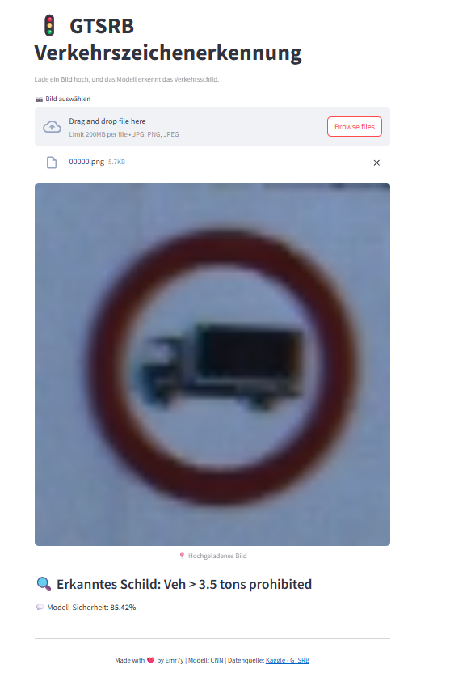

# GTSRB - German Traffic Sign Recognition 🚦

Ein CNN-Modell zur Erkennung deutscher Verkehrsschilder mit einer interaktiven Streamlit-Webanwendung.

---

## ✨ Demo



---

## ⚡ Projektübersicht

* 📂 **Datensatz**: [GTSRB - German Traffic Sign Recognition Benchmark](https://www.kaggle.com/datasets/dk58554/gtsrb-german-traffic-sign)
* 🧠 **Modell**: CNN mit L1/L2-Regularisierung, Dropout & BatchNorm
* 📷 **Streamlit-App** für einfache Bildklassifikation
* ⚖ **Sicherheitsanzeige** (Modellvertrauen in Prozent)
* 🔍 **Label-Vorhersage** mit deutscher Bezeichnung
* 🌐 **GitHub Deployment-ready**

---

## 🔧 Lokales Setup

```bash
# 1. Repository klonen
git clone https://github.com/Emr7y/gtsrb-traffic-sign-recognition.git
cd gtsrb-traffic-sign-recognition

# 2. Virtuelle Umgebung (optional)
python -m venv venv
source venv/bin/activate  # Windows: .\venv\Scripts\activate

# 3. Abhängigkeiten installieren
pip install -r requirements.txt

# 4. Streamlit starten
streamlit run app.py
```

---

## 🔎 Modellüberblick

```python
Conv2D → BatchNorm → Conv2D → BatchNorm → Dropout
→ Conv2D → BatchNorm → Flatten
→ Dense(1024) → Dropout → Dense(256) → Dropout → Dense(43, softmax)
```

---

## 📋 Projektstruktur

```
.
├── app.py                  # Streamlit-App
├── gtsrb_model.keras       # Trainiertes Modell
├── requirements.txt        # Python-Abhängigkeiten
├── demo_screenshot.png     # Screenshot der App
├── README.md               # Diese Datei :)
└── Test/                   # Optional: Beispielbilder (nicht im Repo enthalten, siehe Kaggle-Link)

---

## ❤️ Fußnote

## ❤️ Dank & Quelle

**Made with ❤️ by Emr7y**  
🧠 Modell: Convolutional Neural Network (CNN)  
📦 Datenquelle: [GTSRB – German Traffic Sign Recognition Benchmark](https://www.kaggle.com/datasets/dk58554/gtsrb-german-traffic-sign)

Vielen Dank an die Community & Dataset-Ersteller 
---

## 🚀 Hugging Face Hinweis

> ⚠️ Hinweis: Der Upload von Bildern ist **auf Hugging Face Spaces eingeschränkt** (besonders für Streamlit). Deshalb wird **GitHub als Plattform empfohlen**.
